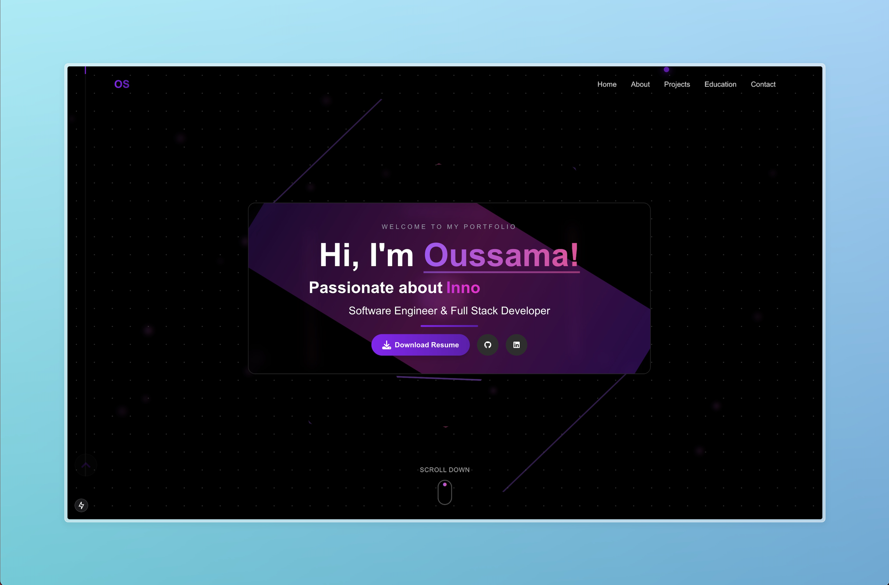

# Portfolio | Oussama Sallak

[](https://osallak.me)
[](https://github.com/osallak/portfolio/blob/main/LICENSE)
[](https://nextjs.org)
[](https://www.typescriptlang.org)
[](https://tailwindcss.com)

A modern, responsive portfolio website built with Next.js, TypeScript, and Tailwind CSS. Featuring interactive animations, GitHub integration, and a sleek dark-themed design.



## ✨ Features

- **Modern UI Design** - Clean, dark-themed interface with glass morphism effects
- **Responsive Layout** - Optimized for all device sizes (mobile, tablet, desktop)
- **Interactive Animations** - Using Framer Motion for smooth transitions and effects
- **GitHub Integration** - Real-time GitHub stats and contribution data
- **Contact Form** - Integrated EmailJS for sending messages directly from the website
- **TypeScript** - Type-safe code for better development experience
- **SEO Optimized** - Proper metadata and OpenGraph tags
- **Performance Optimized** - Fast loading times and optimized assets

## 🚀 Tech Stack

- **Framework**: [Next.js](https://nextjs.org/)
- **Language**: [TypeScript](https://www.typescriptlang.org/)
- **Styling**: [Tailwind CSS](https://tailwindcss.com/)
- **Animation**: [Framer Motion](https://www.framer.com/motion/)
- **Deployments**: [Vercel](https://vercel.com/)
- **Form Handling**: [EmailJS](https://www.emailjs.com/)
- **Icons**: [React Icons](https://react-icons.github.io/react-icons/)
- **Toast Notifications**: [Sonner](https://sonner.emilkowal.ski/)

## 🛠️ Getting Started

### Prerequisites

- Node.js (v18 or later)
- npm or yarn

### Installation

1. Clone the repository:

   ```bash
   git clone https://github.com/osallak/portfolio.git
   cd portfolio
   ```

2. Install dependencies:

   ```bash
   npm install
   # or
   yarn install
   ```

3. Create a `.env.local` file in the root directory and add your environment variables:

   ```
   NEXT_PUBLIC_EMAILJS_SERVICE_ID=your_service_id
   NEXT_PUBLIC_EMAILJS_TEMPLATE_ID=your_template_id
   NEXT_PUBLIC_EMAILJS_PUBLIC_KEY=your_public_key
   NEXT_PUBLIC_TO_NAME=your_name
   ```

4. Start the development server:

   ```bash
   npm run dev
   # or
   yarn dev
   ```

5. Open [http://localhost:3000](http://localhost:3000) in your browser to see the result.

## 📂 Project Structure

```
portfolio/
├── public/              # Static assets
├── src/
│   ├── app/             # App router pages
│   ├── components/      # React components
│   ├── contexts/        # React contexts
│   ├── hooks/           # Custom React hooks
│   ├── types/           # TypeScript type definitions
│   └── utils/           # Utility functions
├── .eslintrc.json       # ESLint configuration
├── next.config.js       # Next.js configuration
├── tailwind.config.js   # Tailwind CSS configuration
└── tsconfig.json        # TypeScript configuration
```

## 🔧 Customization

To customize this portfolio for your own use:

1. Update the personal information in appropriate components
2. Replace project details in `src/components/Projects/index.tsx`
3. Modify the GitHub username in API calls to fetch your own stats
4. Update social media links in `src/components/Contact/index.tsx`
5. Replace images in the `public` directory with your own

## 📱 Responsive Design

The portfolio is designed to be fully responsive across all device sizes:

- **Mobile**: 375px and up
- **Tablet**: 768px and up
- **Desktop**: 1024px and up
- **Large Desktop**: 1280px and up

## 🌐 Deployment

This project is set up for easy deployment on Vercel:

[](https://vercel.com/new/clone?repository-url=https%3A%2F%2Fgithub.com%2Fosallak%2Fportfolio)

## 📄 License

This project is licensed under the MIT License - see the [LICENSE](LICENSE) file for details.

## 🤝 Contact

Oussama Sallak - [@osallak](https://x.com/) - oussamasallak1@gmail.com

Project Link: [https://github.com/osallak/portfolio](https://github.com/osallak/portfolio)

---

Built with ❤️ by [Oussama Sallak](https://github.com/osallak)
